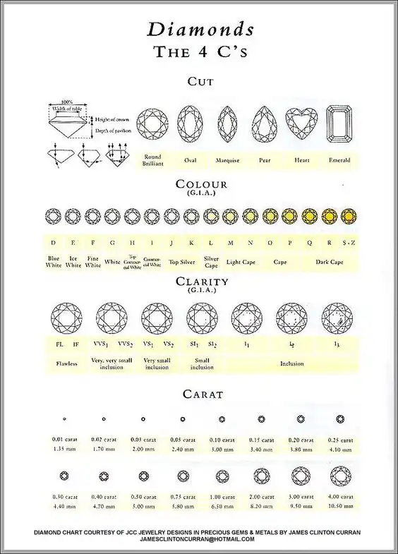

# ih_datamadpt0420_project_m2


# 1. NAME: Exploratory data analysis for a **diamonds** dataset, in order to gain initial insight

# 2. STATUS: Project Module 2 for **Ironhack Data Analysis Bootcamp**

# 3. ONE-LINER: 
#### With this project analysis the reader is going to get a very good idea about how the main features are impacting on price and the correlations between each others. You can visualize many charts in order to capture a large amount of data all at once in a clear and concise manner.
#### Then we will do an statistics analysis to compare prices with a specific value and on the other hand, compare prices of subsets between each others.

# 4. TECHNOLOGY STACK: 

   - We use **python** as a base code lenguage.
   - The library we are going to use in this analysis are the following,
        - Panda
        - Matplotlib
        - Seaborn
        - Cufflinks
        - Plotly Express
        - Scipy.stats
        
   - Also we are going to use **TABLEAU** to generate a dashboard to present with interactive charts

# 5. CORE TECHNICAL CONCEPTS AND INSPIRATION

   - The given dataset of Diamond is a table with information about thousands diamonds with the following features (columns),
        - Carat
        - Cut
        - Color
        - Clarity
        - Depth
        - Table
        - Price
        - x
        - y
        - z
  
 

    - The first thing to do, is a exploring and cleaning the source dataset
    - The plan is to do an individual chart analysis about each feature in contrast of price, in order to evaluate statistics. 
    - We are going to analyze and visualize the distribution of categorical and numerical features.
    - Then we are going to check if there are any correlation between any feature and the price.

# 6. USAGE: 

#### Follow the cells of the jupyter notebook first and then you can connect to my [Public Tabeau Link][1].

[1]: https://public.tableau.com/profile/agustin.arvilla#!/vizhome/IH_Project2-dscleaned/Dashboard1


# 7. FOLDER STRUCTURE
```
└── project
    ├── __trash__
    ├── .gitignore
    ├── README.md
    ├── notebooks
        ├── DiamondHipothesysTest.ipynb
    │   └── DiamondNotebook.ipynb
    └── data
```

# 8. TODO

- The second part of this study is to do a tool to estimate price a part from the features of a diamond.


# 9. CONTACT INFO 

####       aarvillag@gmail.com
